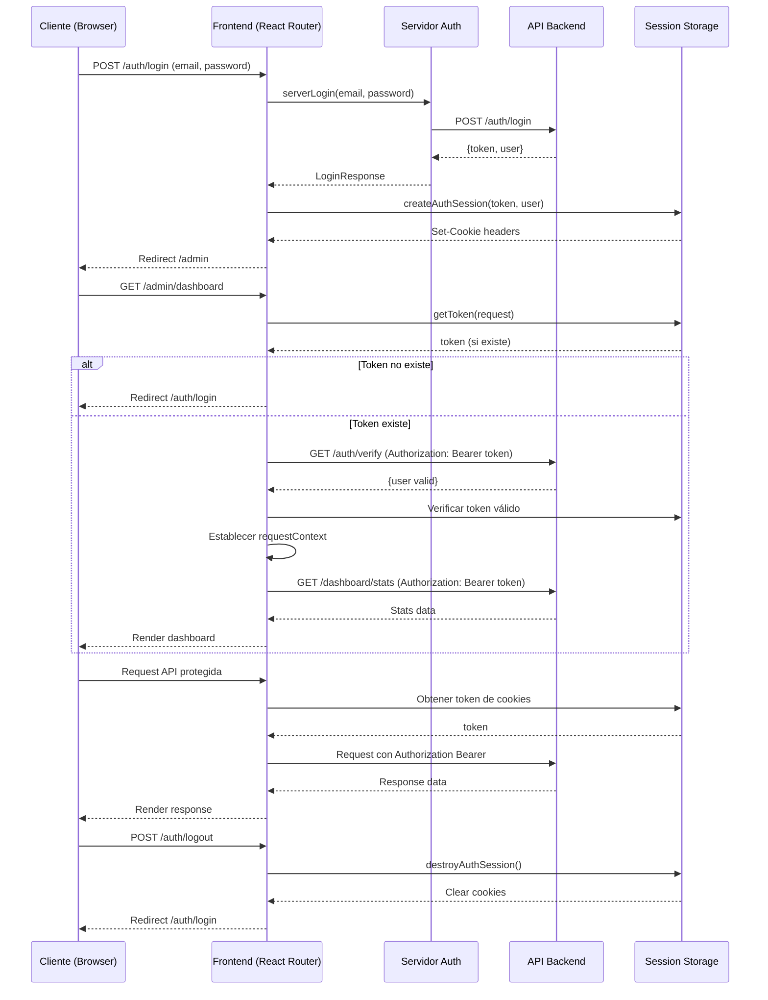

# Flujo de Autenticación y Peticiones - Estudio Glow

## Diagrama Mermaid del Flujo de Peticiones

## Componentes Clave del Sistema

### 1. **Autenticación Server-Side**
- **`serverLogin()`**: Realiza login directo desde servidor
- **`createAuthSession()`**: Crea sesión con token y usuario
- **`requireAuth()`**: Middleware de protección de rutas
- **`getToken()`**: Extrae token de cookies

### 2. **Gestión de Sesiones**
- **Session Storage**: Manejo de cookies con token y user
- **Request Context**: Contexto React con datos de autenticación
- **Token Validation**: Verificación de token en cada request

### 3. **API Client**
- **`apiClient()`**: Cliente HTTP con headers de autorización
- **Bearer Token**: Inyección automática de Authorization header
- **Error Handling**: Manejo de errores de autenticación

### 4. **Protección de Rutas**
- **Layout Loader**: Verificación en `/admin/layout.tsx`
- **Dashboard Loader**: Verificación en páginas específicas
- **Redirect Strategy**: Redirección a login si no autenticado

## Flujo Detallado

### 1. **Proceso de Login**
1. Cliente envía credenciales a `/auth/login`
2. Frontend procesa con `serverLogin()` 
3. API valida credenciales y retorna JWT + user
4. Se crea sesión con `createAuthSession()`
5. Cookie establecida con token y user
6. Redirect a `/admin`

### 2. **Acceso a Rutas Protegidas**
1. Cliente solicita ruta protegida
2. Loader extrae token de cookies con `getToken()`
3. Si no hay token → redirect a login
4. Si hay token → verificar con API `/auth/verify`
5. Si token inválido → redirect a login
6. Si token válido → establecer contexto y renderizar

### 3. **Peticiones API Protegidas**
1. Componente necesita datos de API
2. `apiClient()` obtiene token del contexto
3. Inyecta `Authorization: Bearer token`
4. API procesa request con token válido
5. Retorna datos al componente

### 4. **Manejo de Errores**
- **401 Unauthorized**: Redirect automático a login
- **Token expirado**: Destruir sesión y redirect
- **Network errors**: Manejo con fallbacks

## Seguridad Implementada

### ✅ **Seguridad de Token**
- JWT almacenado en cookies HTTP-only
- Token enviado en Authorization header
- Verificación de token en cada request

### ✅ **Protección de Rutas**
- Middleware `requireAuth()` en loaders
- Verificación server-side antes de render
- Redirect automático a login

### ✅ **Context Management**
- RequestContext con datos de usuario
- Token disponible para componentes
- Session storage persistente

### ✅ **API Security**
- Bearer token authentication
- CORS configurado
- Error handling seguro

## Tecnologías Utilizadas

- **React Router v7**: Routing y loaders
- **Server-Side Auth**: Autenticación en servidor
- **JWT Tokens**: Autenticación stateless
- **Cookies**: Almacenamiento de sesión
- **React Context**: Manejo de estado de autenticación
- **TanStack Query**: Cache y sincronización de datos
